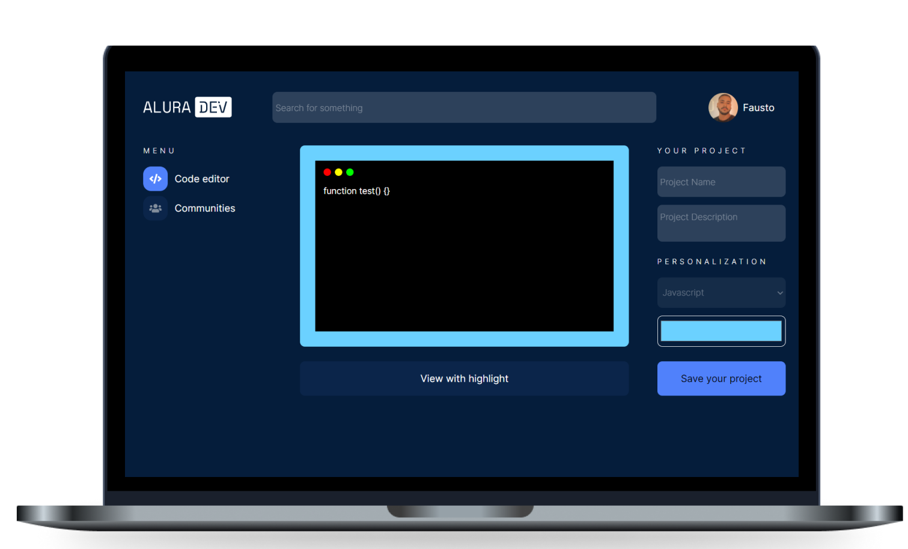

<h1 align="center">
  
</h1>

  <a href="#-acesso">Acesso</a>&nbsp;&nbsp;&nbsp;|&nbsp;&nbsp;&nbsp;
  <a href="#-tecnologias">Tecnologias</a>&nbsp;&nbsp;&nbsp;|&nbsp;&nbsp;&nbsp;
  <a href="#-projeto">Projeto</a>&nbsp;&nbsp;&nbsp;|&nbsp;&nbsp;&nbsp;
  <a href="#-layout">Layout</a>&nbsp;&nbsp;&nbsp;|&nbsp;&nbsp;&nbsp;
  <a href="#memo-licença">Licença</a>

 
  

 

  

## 😁 Acesso

Acesse e veja você mesmo: https://alura-dev-nine.vercel.app/

## 🚀 Tecnologias

Esse projeto foi desenvolvido com as seguintes tecnologias:

- HTML
- CSS
- JavaScript

## 💻 Projeto

O aluradev é um projeto com a alura que permite a estilização e compartilhamento de código dentre diversas linguagens

## 🔖 Layout

Você pode visualizar o layout do projeto através [desse link](https://www.figma.com/file/Ve4hpTfmMa7yAFneoGtGKD/Alura-Challenge---Edi%C3%A7%C3%A3o-Front-end?node-id=207%3A729&viewport=86%2C-1148%2C0.3736729025840759). É necessário ter conta no [Figma](https://figma.com) para acessá-lo.

## :memo: Licença

Esse projeto está sob a licença MIT. Veja o arquivo [LICENSE](LICENSE.md) para mais detalhes.

---
